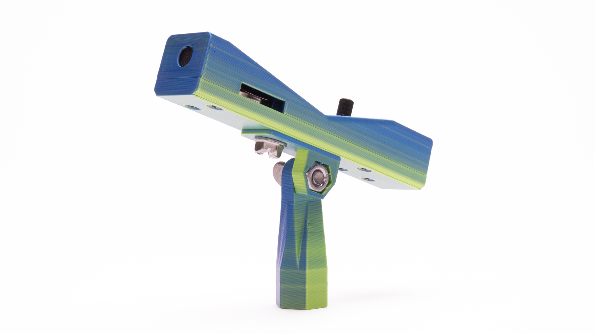
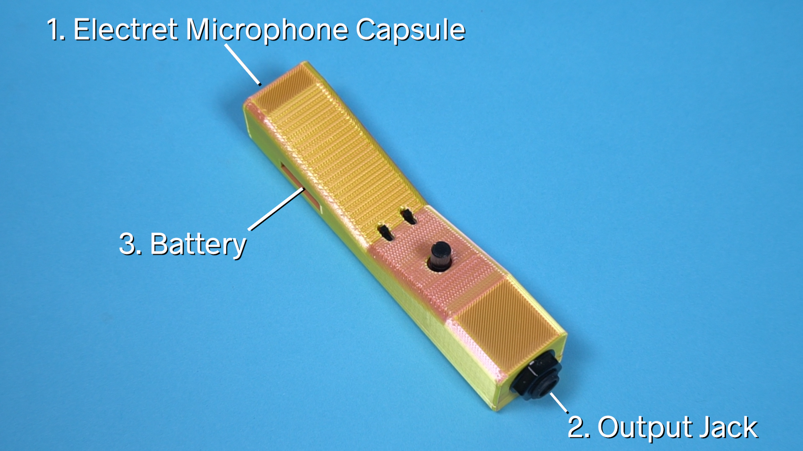
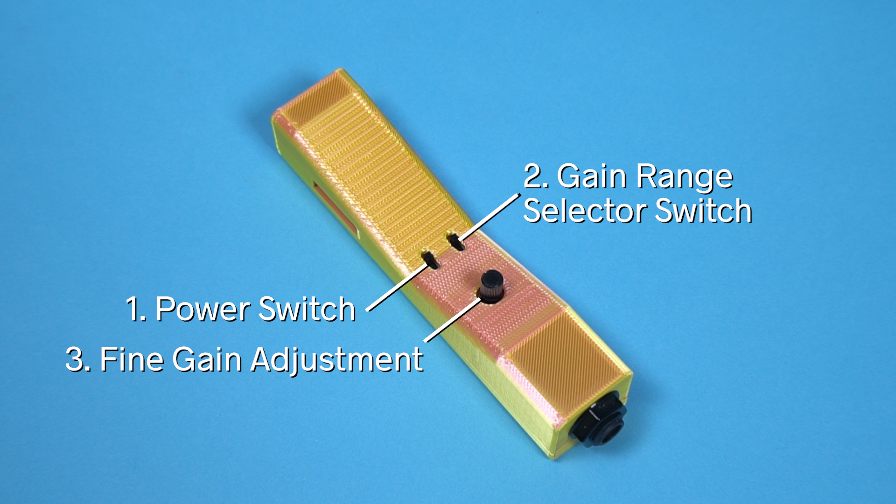

# Critter & Guitari® Microphone Manual

©2022 Critter & Guitari. All Rights Reserved.

Thank you for getting a **Critter & Guitari® Microphone** This is the place to begin on your journey to capturing sounds.

> Warning: As with all microphones, this mic is may generate 'feedback' if pointed at an amplified speaker which is amplifying the output of the microphone. **Please take care to avoid feedback and thus protecting your hearing! Safety first!**

## Specifications

##### Ins & Outs:

1. The `Electret Microphone Capsule` is a monophonic input. It transduces sound pressure waves from the air into an electric signal. The capsule cannot be seen directly - the black felt covering the capsule can be seen through a hole in the front of the enclosure. It has an omnidirectional pickup pattern.
2. `Output Jack`. A black monophonic 1/4" output jack can be found on the end opposite the microphone capsule. This jack has a TS (tip/sleeve) connection for an unbalanced signal.
3. `Battery`. One *2032* coin cell battery provides power. The *+* (positive) side of the battery faces up. 

##### Controls:

1. `Power switch` The mic can be powered on by moving the switch to the 'front' position (towards the felted mic capsule). The 'off' position is towards the 1/4" jack.

2. `Gain Range Selector Switch` Setting this switch position towards the 1/4" jack selects 'low' gain range. Moving this switch towards the felted mic capsule selects the 'high' gain range.  

3. `Fine Gain Adjustment` This potentiometer fine tunes the gain and is used in both gain ranges.

##### Hardware Connections:

1. The bottom of the articulating stand has standard 3/8"-16 threads.
2. The articulating stand may be removed from the body of the mic. If the stand is removed, other connections utilizing the embedded 1/4"-20 thread are possible. 

## How to Use:
1. **Before operating, remove the paper tab from underneath the battery.**
2. Situate the microphone on a mic stand or other device. Loosening the thumb screw in the mic stand allows for the stand to pivot. Be sure to tighten it again!
3. Connect a monophonic cable with a 1/4" plug to the mic's 1/4" jack and to the subsequent device in your signal chain (mixer, recorder, pedals, etc.)
4. Ready to capture sound! Basic rule of thumb: start with the **low gain range** selected and with the fine tune adjustment potentiometer set to low (turned left). Increase gain pot until your sound is heard at an agreeable level. If it isn’t, turn potentiometer down (to left) and switch range to High. Then slowly increase pot…

**Replacing battery**: use the square hole opposite battery slot and a paper clip (or similar tool) to push battery out.
The *+* (positive) side of the battery faces up. 
Be sure to turn mic off to save battery life!

	